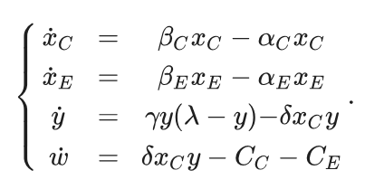
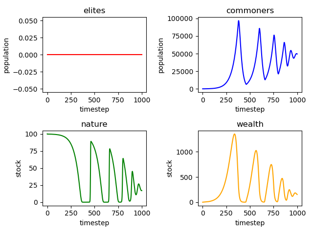
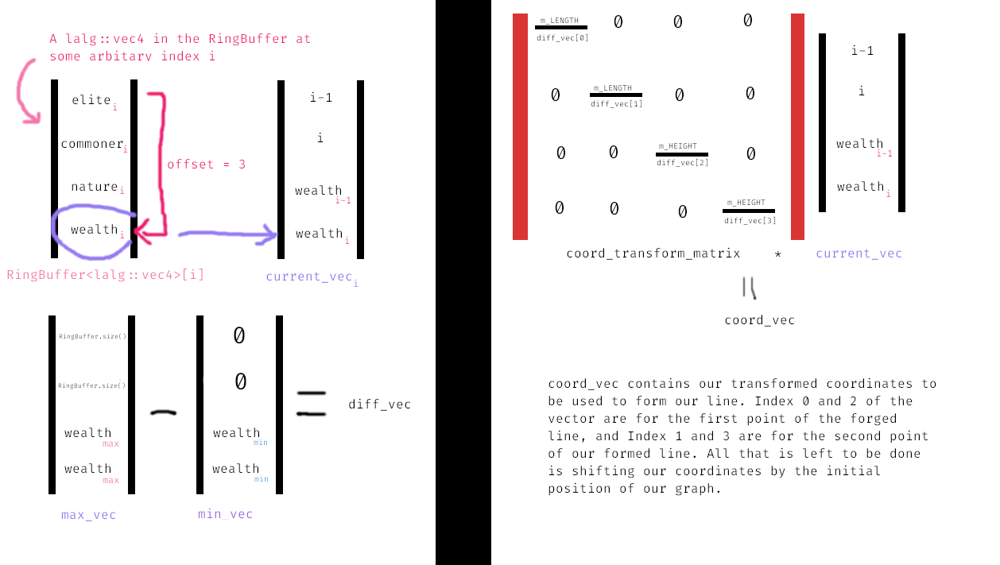
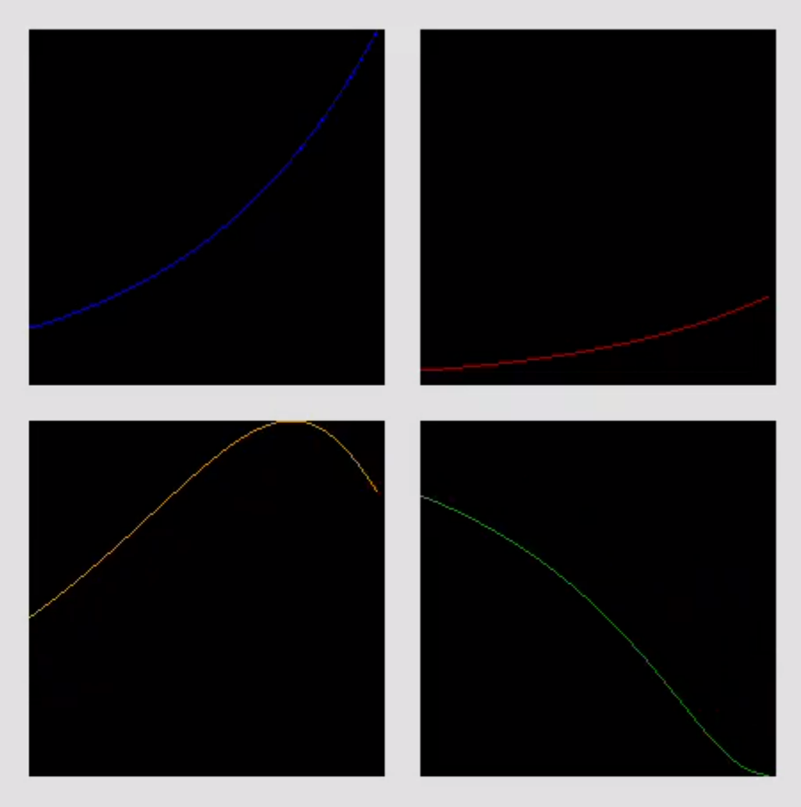

# MiniProjects_and_Algos

A collection of miniature projects I've done in my freetime. 

___
## Human and Nature Dynamics (HANDY) Differential Equation Simulation

Based on the paper by Safa Motesharrei, Jorge Rivas, and Eugenia Kalnay: "Human and nature dynamics (HANDY): Modeling inequality and use of resources in the collapse or sustainability of societies," pursued off the recommendation of Dr. Carey King.

Consists of 4 differential equations...
1. Human Populations, divided into an "Elite" and "Commoner" population
2. Natural Supply, has a natural regeneration rate and depletion rate by humans
3. Wealth Supply, stock extracted from nature to be used by Human Populations and a buffer between drainage of natural supply & consumption by humans



In our code they're represented by population structs:

```cpp
struct population { float stock, flow; } // x , dx/dt

// represent our other populations, have both a 'stock' and a 'flow' among other fields
struct human_pop : population;
struct nature_stock : population;
struct wealth_stock : population;

// initializer, there are actually four of these, one for each differential equation in the system
void init_population(... args);

human_pop& calcFlow(human_pop& hp);
nature_stock& calcFlow(nature_stock& nst, human_pop& commoner_hp);
wealth_stock& calcFlow(wealth_stock& wst, nature_stock& nst, human_pop& elite_hp, human_pop& commoner_hp);
```

Calculating the solution is a matter of just taking the integral of the calculated flow. This is further simplified since our System of Differential Equations is Autonomous.
```cpp
population& calcStock(population& pop, const float begin, const float end, const bool use_prev) {
	const float dt = 0.001f;
	float sum = 0.0f + pop.stock * use_prev;
	float t = begin;

	while (t < end) {
		sum += pop.flow * dt;
		t += dt;
	}

	bool eq_bounds = begin == end;
	pop.stock = sum * !eq_bounds + pop.stock * eq_bounds;
	return pop;
}
```

Here are a couple example graphs I got by taking the values I got via the simulation, transferring them into a .csv, and plotting them using matplotlib:



### Changes as of December 24th, 2023:

Added the entire set of equilibrium equations noted on the paper and their default values. The notable ones are all listed in the following enum, and can be called via the function `setEquilibriumValues(EquilibriumStates state)`. The equilibrium conditions set by each of these states are noted in the paper but you can see the variables I set in the HANDYSim/Populations.h file if you want to see the code, but it's honestly just a switch case.

```cpp
enum EQUILIBRIUM_STATES {
	EGALITARIAN_SOFT_LANDING,
	EGALITARIAN_OSCILLATE_TOWARDS_EQUILIBRIUM,
	EGALITARIAN_CYCLES_AND_REVIVAL,
	EGALITARIAN_FULL_COLLAPSE,
	EQUITABLE_SOFT_LANDING,
	EQUITABLE_OSCILLATE_TOWARDS_EQUILIBRIUM,
	EQUITABLE_CYCLES_AND_REVIVAL,
	EQUITABLE_FULL_COLLAPSE,
	EQUITABLE_FULL_COLLAPSE_PREVENTION,
	UNEQUAL_TYPE_L_COLLAPSE,
	UNEQUAL_TYPE_N_COLLAPSE,
	UNEQUAL_SOFT_LANDING,
	UNEQUAL_OSCILLATE_TOWARDS_EQUILIBRIUM
};
```

Second major addition (as of this date) is the implementation of a graphics component. Before I was simply computing all the 'stocks' or integrals at each timestep using a numerical method, writing them to a CSV file, and then graphing the four equations in python. Now I'm rendering the actual dynamics of our elite population, commoner population, nature stock, and wealth stock during runtime using SFML. Notable components are: columns indicating the 'size' and 'direction' of each stock, and a plot over time. 

#### Columns

Implementation is pretty straightforward here. I have a column class called ColumnShape in ColumnShape.h, composed of 2 `sf::CircleShape`s and one `sf::RectangleShape`. Functions for changing the height, radius, and position of said Column were all implemented since it's effectively a shape. Once the stock values for our four equations are calculated via `calcStock()`, they're normalized based on the maximums of each stock (so elite and commoner populations are normalized to the maximum of the two thus far, nature is normalized to its carrying capacity, wealth to its maximum so far) and then passed in as heights for the column. The tris are there to complement the columns, they're just triangles signifying whether the flow (rate of change... derivative) of the column is positive, negative, or zero -- pointing up, down, or sideways. The tris make use of SFML's `sf::CircleShape` with 3 points specified to get a triangle shape out.

```cpp
// Code snippet for initializing the four columns, nothing crazy here (in main.cpp)
void init_columns(std::vector<ColumnShape*>& cols, float c_rad, float c_height, float c_spacing, uint32_t CCs[4], sf::Vector2f ref_pos) {
	for (int i = 0; i < cols.size(); i++) {
		ColumnShape* col_ptr = cols[i];
		col_ptr->setRadius(c_rad); // column radius
		col_ptr->setHeight(c_height);
		col_ptr->setPosition(ref_pos + sf::Vector2f((-2 + i) * c_spacing, 0)); // so the four columns are all centered around a midpoint
		col_ptr->setColor(CCs[i]);
	}
}

// Code for setting column color, always try to make sure the "top" of the column is darkest (in the ColumnShape.h file)
void ColumnShape::setColor(const uint8_t r, uint8_t g, uint8_t b) {
	this->bar.setFillColor(sf::Color(r, g, b, 0xFF));
	this->base.setFillColor(sf::Color(r, g, b, 0xFF));
	this->top.setFillColor(sf::Color(r / 3, g / 3, b / 3, 0xFF));
}

// The other setColor function (in the ColumnShape.h file)
void ColumnShape::setColor(uint32_t color) {
	uint8_t colors[3] = {0x0, 0x0, 0x0};

	color = color >> 8; // skip past alpha channel
	for (int i = 0; i < 3; i++) {
		colors[2 - i] = color & 0xFF;
		color = color >> 8;
	}

	this->setColor(colors[0], colors[1], colors[2]);
}
```

A picture of the columns & tris:


#### Real Time Plots / Graphing

The next component I've added is a plotter that graphs the last 100 stock values computed. This was done via the implementation of a RingBuffer data structure, a Plotter class, along with some matrix math for mapping current values to vertices on the graph. The RingBuffer class is there to easily handle the 'stream' of data that's constantly being used for graphing, especially since I'm only graphing a fixed amount of values for a given stock which I've set to be 100. Within the RingBuffer is an iterator that travels from the 'first' index in the RingBuffer to 1 before the 'last' index. I'll put some RingBuffer functions I particularly liked making, though I feel I went too far with the booleans.

```cpp
// RingBuffer fields
template <typename Type>
class RingBuffer {
private:
    unsigned int m_first = 0;   // first index
    unsigned int m_last = 0;    // last index
    unsigned int m_capacity;    // number of 'open' spots left
    bool m_full;                // do the open spots == 0 ?
    std::vector<Type> m_buffer; // container
    class rbIterator;
    
    ...
    ...
}

// insert an element into the ringbuffer
void RingBuffer::insert(Type val) {
	m_buffer[m_last] = val;

	m_capacity = m_capacity - 1 * !m_full;
	m_full = m_capacity == 0;
	m_last = (m_last + 1) * !(m_last == m_buffer.size() - 1);
	m_first = (m_first + m_full) * !(m_first == m_buffer.size() - 1);
}

// Increments the iterator to point to the next item in the ringbuffer
rbIterator& RingBuffer::rbIterator::operator++(int) {
	bool at_end = (m_index == m_parent->m_buffer.size() - 1 || m_index == m_parent->m_last);
	m_index = (m_index + 1) * !at_end + m_parent->m_first * at_end * !m_parent->m_full;
	m_data = m_parent->m_buffer[m_index];
	return *this;
}
```

Moving onto the Plotter.class, it's composed of a `std::vector<sf::Vertices>` field of constant size, determined upon initialization, along with a user-specified length, height, position, and color (for both the actual plots & background). The constructor is shown below:

```cpp
// Planning to add text fields to this in the future for titling the graph, labeling axes, and displaying values
Plotter(sf::Vector2f size, unsigned int NUMBER_OF_POINTS, sf::Color line_color = sf::Color::Black, sf::Color bg_color = sf::Color::White) 
	: m_LENGTH((int) size.x), m_HEIGHT((int) size.y), m_POINTS_TO_RENDER(0) {
	m_vertices = std::vector<sf::Vertex>(NUMBER_OF_POINTS * 2);
	m_PLOT_COLOR = line_color;
	m_bg = sf::RectangleShape(size); // background is basically just a rectangle
	m_bg.setFillColor(bg_color);  // rectangle color
}
```

The most interesting function of the Plotter class to me (or the one I enjoyed making the most) is the `setVertices()` function. It's used for actually populating the std::vector of vertices `m_vertices` with vertices to be used in the `draw()` function. setVertices takes in a few paramters: a RingBuffer of linear algebra vectors (`lalg::vec4`) of size 4 (holding our four stocks: elite pop, commoner pop, nature stock, wealth stock), an unsigned integer offset to specify which of the four stocks we're plotting (so 0 would be the first value of the vector, 1 the second, and so on...), and 2 vectors holding maximums and minimums to be used in the normalization process of our stocks as they're transformed to vertices called `max_vector` and `min_vector` (note that `min_vector` is defaulted to a zero vector if the value is left unspecified). A messy diagram of how this all comes together is below (made in GIMP, shoutout GIMP).



The code is a little messier, for example: instead of the previous index being - 1, it's - 2 since every value in the RingBuffer gets two vertices in the list to form a line. I also subtract the y-coordinates I get for my vertices from m_HEIGHT since SFML's y-axis is inverted (0 is the top, window.size().y is the bottom).

```cpp
void setVertices(RingBuffer<lalg::vec4>& rb, unsigned int offset, const lalg::vec4& MAX_VEC, const lalg::vec4& MIN_VEC = lalg::zeroVec()) {
    using namespace lalg; // less typing 

    mat4 coord_transform;
    {
        vec4 diff_vec = MAX_VEC - MIN_VEC;
        const vec4 diagonal_inverse_vec = { diff_vec.r / m_LENGTH, diff_vec.g / m_LENGTH, diff_vec.b / m_HEIGHT, diff_vec.a / m_HEIGHT };
        coord_transform = diag(map(diagonal_inverse_vec, [](float f) {return 1.f / (f + 0.001f * (f == 0.0f));  })); // diag(vector^-1)
    }

    vec4 current_vec = { 0 /*prev index*/, 1 /*index*/, getValue(rb.front(), offset) /*prev*/, 0 /*current*/ };
    RingBuffer<vec4>::iterator it = rb.begin();
    while (it != rb.end() && current_vec.r < m_vertices.size()) {

        current_vec.g = (current_vec.r - 2) * (current_vec.r != 0); // boolean to handle edge-case at start
        current_vec.a = getValue(it.m_data, offset); // current value
        vec4 coords = coord_transform * (current_vec - MIN_VEC); // transformed coordinates

        m_vertices[(int) current_vec.r].position = m_origin + sf::Vector2f(coords.g, m_HEIGHT - coords.b); // index . pos = ~~~
        m_vertices[(int) current_vec.r].color = m_PLOT_COLOR; // index . color = ~~~
        m_vertices[(int) current_vec.r + 1].position = m_origin + sf::Vector2f(coords.r, m_HEIGHT - coords.a); // index + 1 . pos ~~~
        m_vertices[(int) current_vec.r + 1].color = m_PLOT_COLOR; // index + 1 . color  = ~~~

        current_vec.r += 2; // update index
        current_vec.b = current_vec.a; // update prev
        it++;
    }

    m_POINTS_TO_RENDER = (unsigned int) current_vec.r;
}
```



### Changes as of January 15th, 2024

First of all, happy new years. Most of the changes here are visual, and I hope to refactor most of this later on & get better at making shaders so this is what I have for now.

https://github.com/KaytchJam/Idea_Playground/assets/59188754/cc0c49d1-c8c8-4b03-9308-9b81912ae165

### Changes as of February 1st, 2024

Lots of changes though much of that went into refactoring as I mentioned above. Before the state was determined by initial conditions (the EQUILIBRIUM_STATE initially passed in)
but now I'm actively keeping track of state (for the columns, elements, text, and so on) which allows for the switching as shown in the video.

#### Additional Note

Throughout `main.cpp` and other files there are calls to the namespace `lalg`, particularly the `lalg::vec4` and `lalg::mat4` structs. This is miniature linear algebra library (loosely) that I had made whilst getting carried away with another project and everything related to it is in the `MyTools/MyV.h` file. It's more or less there so I can have size 4 vectors (SFML only has size 2 vectors and size 3 x 3 tranformation matrices, and i was too lazy to link GLM) and implement functions like `diag()`, `map()`, `transpose()`, and retrieving matrix columns as vectors (`lalg::mat4` is implemented as a struct of row vectors).

Extra Extra note: the reason for the struct reference returns is because method chaining is cool that's pretty much it lol

Citation:

Safa Motesharrei, Jorge Rivas, Eugenia Kalnay, 
Human and nature dynamics (HANDY): Modeling inequality and use of resources in the collapse or sustainability of societies, 
Ecological Economics, 
Volume 101, 
2014, 
Pages 90-102, 
ISSN 0921-8009, 
https://doi.org/10.1016/j.ecolecon.2014.02.014. (https://www.sciencedirect.com/science/article/pii/S0921800914000615)

Abstract: There are widespread concerns that current trends in resource-use are unsustainable, but possibilities of overshoot/collapse remain controversial. Collapses have occurred frequently in history, often followed by centuries of economic, intellectual, and population decline. Many different natural and social phenomena have been invoked to explain specific collapses, but a general explanation remains elusive. In this paper, we build a human population dynamics model by adding accumulated wealth and economic inequality to a predator–prey model of humans and nature. The model structure, and simulated scenarios that offer significant implications, are explained. Four equations describe the evolution of Elites, Commoners, Nature, and Wealth. The model shows Economic Stratification or Ecological Strain can independently lead to collapse, in agreement with the historical record. The measure “Carrying Capacity” is developed and its estimation is shown to be a practical means for early detection of a collapse. Mechanisms leading to two types of collapses are discussed. The new dynamics of this model can also reproduce the irreversible collapses found in history. Collapse can be avoided, and population can reach a steady state at maximum carrying capacity if the rate of depletion of nature is reduced to a sustainable level and if resources are distributed equitably.

Keywords: Human–nature dynamics; Societal collapse; Carrying capacity; Overshoot vs. sustainability; Economic inequality; Ecological strain
___
## JJK Domains

The gist of this project is modelling a construct called "Domains" from a show called [Jujutsu Kaisen](https://en.wikipedia.org/wiki/Jujutsu_Kaisen). To focus squarely on domains; they're spherical constructs created by a special kind of energy generated and manipulated by characaters in the series called Cursed Energy. A barrier has 3 main components to be recognized as complete: **a barrier**, an associated **innate domain**, and an **imbued technique**. 

#### Todo List

- [ ] **GENERAL:**
    - [x] Render loop
    - [x] Mouse click & position detection
    - [ ] Background 
        - [x] General background
        - [ ] Dark mode toggle?
        - [ ] Some sort of map overlay would be cool
        - [ ] Numbers on grid as reference
    - [ ] Project title somewhere on screen
    - [ ] View matrix 
        - [ ] More dynamic camera or zooming functionality
        - [ ] Fix fullscreen stuffs
- [ ] **DOMAIN CLASS:**
    - [x] General domain parent class
        - [ ] Tug of wars
            - _make tug of wars better later_
            - _use actual physics as reference_
        - [x] Make domain transparent on tug of wars
        - [x] General getter functions
            - GetRadius
            - GetBoundingBox
            - Get Refinement
            - ...
        - [ ] Set upper bound on domain size during tug of wars
            - Have refinement be inversely proportional to domain size?
    - [ ] Finish Closed Domains
        - [ ] Turn of detection on WorldEntities w/out CE
    - [ ] Finish Open Domains
        - [x] Get OpenDomain.shader working for segmented animation
        - [ ] Maintain detection of WorldEntities w/out CE
    - [ ] Finish Simple Domains
        - [ ] Remove tug of war capability
    - [x] Working collision detection
- [ ] **WORD ENTITIES:**
    - [ ] CE Objects
        - [ ] Sorcerers (can deploy domains)
        - [ ] Non-sorcerers (cannot deploy domains)
    - [ ] Structures
- [ ] **DATA STRUCTURES & MANAGERS:**
    - [ ] Domain Manager
        - [x] Domain Manager working with std::vector
            - Replace w/ Quadtree or BVH Tree
        - [x] Domain Insertion
            - [x] `bool add(Domain& d)`
            - [x] `bool add(Domain* d)`
            - [x] `bool add(DomainType type, float radius = 150.f, sf::Color color = sf::Color::Red, float refine_val = 0.5f, sf::Vector2f centerCoords = sf::Vector2f(0.f, 0.f));`
        - [x] Collision detection working
        - [ ] Add a toggle-able text list for debugging
    - [ ] UI Manager
        - [ ] Finish all the UI elements first lol
    - [ ] Quadtree
        - [ ] Append to domain manager
    - [ ] BVH Tree
        - [ ] Append to domain manager
- [ ] **UI ELEMENTS:**
    - [ ] Button class
        - [x] Get clicks working
        - [x] Callback
        - [ ] Finish shader for rounding the button's corners
        - [ ] Domain Buttons
            - [x] Make domain spawning button
            - [x] Make button for changing domain type (OPEN, CLOSED, SIMPLE)
    - [ ] Slider class
        - [x] Callback 
        - [ ] Draggable slider
            - [ ] Way to set upper and lower bounds
        - [ ] Domain Sliders
            - [ ] Slider to change domain radius
            - [ ] Slider to change domain refinement
    - [ ] UIGroup (TBD)
        - [ ] Popup UI Groups
            - [ ] Make them appear on right click
            - [ ] Couple UIGroup w/ Domains & World Entities
        - [ ] General UI Group
        - [ ] Setup shared callback struct among groups & sub-UI Elements

#### Domains
###### OpenDomains

###### ClosedDomains


## Sort Animations

Literaly just sort animations lol. Right now it's just selection sort that's visualized, don't really feel like adding more anytime soon lol.

#### Structure

Revolves around the `SortAnim` parent class, which has functions `onUpdate()` and `onRender()` called within the render loop. `main` is short enough so I'll just drop the function below:

```cpp
int main() {
	sf::RenderWindow window(sf::VideoMode(800, 600), "sort_animation");

	const unsigned int NUM_ELEMENTS = 50;
	std::vector<int> nums(NUM_ELEMENTS);
	for (int i = 1; i <= NUM_ELEMENTS; i++)
		nums[i - 1] = i;

	std::srand(unsigned(std::time(0)));
	std::random_shuffle(nums.begin(), nums.end());

	window.setFramerateLimit(30);
	window.setKeyRepeatEnabled(false);

	SortAnim* s = new SelectionSortAnim(window, nums);

	while (window.isOpen()) {
		sf::Event event;
		while (window.pollEvent(event)) {
			if (event.type == sf::Event::Closed) window.close();
			if (event.type == sf::Event::MouseButtonPressed) mouse_states.MOUSE_HELD = true;
			if (event.type == sf::Event::MouseButtonReleased) mouse_states.MOUSE_HELD = false;
		}

		window.clear();
		s->onUpdate();
		s->onRender();
		window.display();
	}

	delete(s);
	return 0;
}
```
