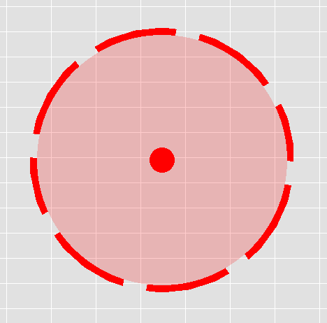
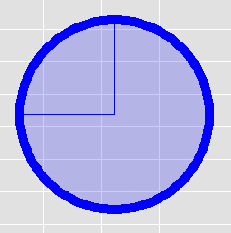

# MiniProjects_and_Algos
___
## JJK Domains
#### Todo List

- [ ] **GENERAL:**
    - [x] Render loop
    - [x] Mouse click & position detection
    - [ ] Background 
        - [x] General background
        - [ ] Dark mode toggle?
        - [ ] Some sort of map overlay would be cool
        - [ ] Numbers on grid as reference
    - [ ] Project title somewhere on screen
    - [ ] View matrix 
        - [ ] More dynamic camera or zooming functionality
        - [ ] Fix fullscreen stuffs
- [ ] **DOMAIN CLASS:**
    - [x] General domain parent class
        - [ ] Tug of wars
            - _make tug of wars better later_
            - _use actual physics as reference_
        - [x] Make domain transparent on tug of wars
        - [x] General getter functions
            - GetRadius
            - GetBoundingBox
            - Get Refinement
            - ...
        - [ ] Set upper bound on domain size during tug of wars
            - Have refinement be inversely proportional to domain size?
    - [ ] Finish Closed Domains
        - [ ] Turn of detection on WorldEntities w/out CE
    - [ ] Finish Open Domains
        - [x] Get OpenDomain.shader working for segmented animation
        - [ ] Maintain detection of WorldEntities w/out CE
    - [ ] Finish Simple Domains
        - [ ] Remove tug of war capability
    - [x] Working collision detection
- [ ] **WORD ENTITIES:**
    - [ ] CE Objects
        - [ ] Sorcerers (can deploy domains)
        - [ ] Non-sorcerers (cannot deploy domains)
    - [ ] Structures
- [ ] **DATA STRUCTURES & MANAGERS:**
    - [ ] Domain Manager
        - [x] Domain Manager working with std::vector
            - Replace w/ Quadtree or BVH Tree
        - [x] Domain Insertion
            - [x] `bool add(Domain& d)`
            - [x] `bool add(Domain* d)`
            - [x] `bool add(DomainType type, float radius = 150.f, sf::Color color = sf::Color::Red, float refine_val = 0.5f, sf::Vector2f centerCoords = sf::Vector2f(0.f, 0.f));`
        - [x] Collision detection working
        - [ ] Add a toggle-able text list for debugging
    - [ ] UI Manager
        - [ ] Finish all the UI elements first lol
    - [ ] Quadtree
        - [ ] Append to domain manager
    - [ ] BVH Tree
        - [ ] Append to domain manager
- [ ] **UI ELEMENTS:**
    - [ ] Button class
        - [x] Get clicks working
        - [x] Callback
        - [ ] Finish shader for rounding the button's corners
        - [ ] Domain Buttons
            - [x] Make domain spawning button
            - [x] Make button for changing domain type (OPEN, CLOSED, SIMPLE)
    - [ ] Slider class
        - [x] Callback 
        - [ ] Draggable slider
            - [ ] Way to set upper and lower bounds
        - [ ] Domain Sliders
            - [ ] Slider to change domain radius
            - [ ] Slider to change domain refinement
    - [ ] UIGroup (TBD)
        - [ ] Popup UI Groups
            - [ ] Make them appear on right click
            - [ ] Couple UIGroup w/ Domains & World Entities
        - [ ] General UI Group
        - [ ] Setup shared callback struct among groups & sub-UI Elements

#### Domains
###### OpenDomains

###### ClosedDomains
